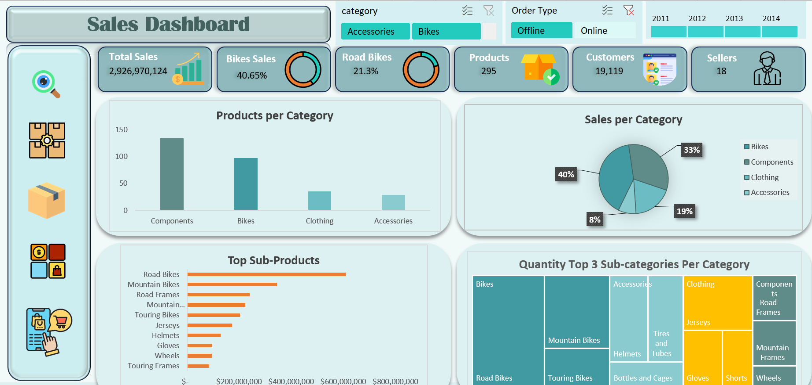
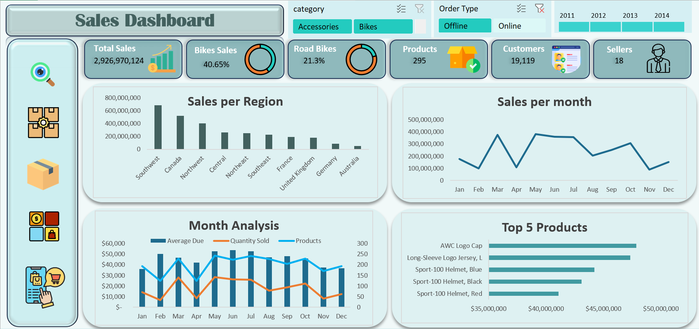
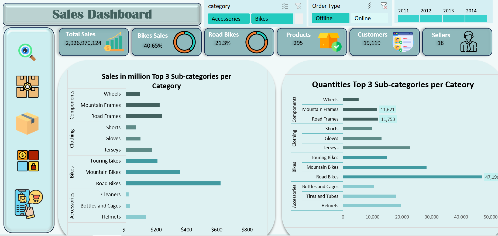
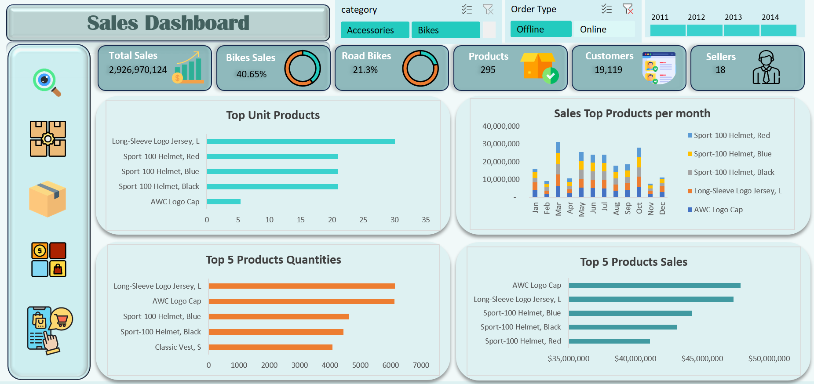

# Adventure Works Sales Dashboard

> A multi-view Excel sales dashboard analyzing **$2.93 billion** in sales across 10 territories, 4 product categories, and 4 years (2011–2014) — built with PivotTables, PivotCharts, and interactive slicers.

---

## Dashboard Preview

| View 1 — Product & Category | View 2 — Region & Monthly |
|---|---|
|  |  |

| View 3 — Subcategory Deep Dive | View 4 — Top Products |
|---|---|
|  |  |

---

## Live Demo (GitHub Pages)

> 🌐 **[View the Portfolio Case Study →](https://nouraelsaman.github.io/Adventure-Work_Sales_Excel_Dashboard/)**

A static HTML/CSS case study presenting the real dashboard through verified KPIs, screenshots, business questions, and key insights.

---

## Overview

This project analyzes the Adventure Works sample dataset — a Microsoft reference dataset representing a fictional sporting goods manufacturer — to answer concrete business questions about sales performance across time, geography, product mix, and order channels.

The dashboard was built entirely in **Microsoft Excel** using:
- PivotTables for data aggregation
- PivotCharts for visualization (18 charts verified)
- Slicers for interactive filtering
- Excel Data Analysis ToolPak for descriptive statistics

---

## Headline KPIs

All values are read directly from the dashboard or workbook PivotTable output. None have been estimated.

| KPI | Value |
|---|---|
| **Total Sales** | **$2,926,970,124** |
| Total Orders | 31,465 |
| Total Units Sold | 274,914 |
| Distinct Customers | 19,119 |
| Distinct Products | 295 |
| Salespeople | 18 |
| Bikes Sales Share | **40.65%** |
| Road Bikes Share | **21.3%** |
| Offline Channel Sales | ~$2.86B (97.8%) |
| Online Channel Sales | ~$65.4M (2.2%) |

---

## Business Questions Answered

### 1. Which product category generates the most revenue?
**Bikes** leads at **40.65%** of total sales (~$1.19B). Components follow at 31.79% (~$929.6M). Together they represent over 72% of revenue.

### 2. Which region performed best?
**Southwest** at **$696.9M** — the highest of all 10 territories, followed by Canada ($527.0M) and Northwest ($411.2M). Australia had the lowest performance at $70.6M.

### 3. What is the strongest month for sales?
**May ($391.0M)** and **March ($382.6M)** are the two peak months. November is the weakest at $94.9M — a peak-to-trough ratio of approximately **4.1×**.

### 4. Which subcategory generates the highest sales?
**Road Bikes at $624.9M** — the single largest subcategory, representing 21.3% of all sales. Mountain Bikes follow at $357.0M.

### 5. How does offline vs. online channel revenue compare?
By **sales value**: Offline dominates at ~$2.86B (97.8%) vs Online ~$65.4M (2.2%).  
By **order count**: Online has more transactions (27,659) than Offline (3,806).  
This means offline orders average ~$752K each vs ~$2,366 for online — consistent with large Bike orders being placed offline.

### 6. Which products appear in the top 5 by total sales?
Based on the "Top 5 Products" chart: **AWC Logo Cap**, **Long-Sleeve Logo Jersey L**, **Sport-100 Helmet Blue**, **Sport-100 Helmet Black**, and **Sport-100 Helmet Red** — each in the ~$35M–$50M range.

### 7. What is the relationship between unit volume and revenue by product?
Road Bikes lead by **revenue** ($624.9M) but not by **units sold**. The top-volume products are low-unit-price accessories (Long-Sleeve Logo Jersey L, AWC Logo Cap, Sport-100 Helmets). This illustrates the classic revenue-vs-volume trade-off in a mixed product portfolio.

---

## Key Insights

### 🌍 Regional Hierarchy
Southwest ($696.9M) > Canada ($527.0M) > Northwest ($411.2M). The top three North American territories generate significantly more revenue than all other territories combined. Australia ($70.6M) and Germany ($92.7M) are the lowest-performing territories.

### 📅 Seasonal Sales Pattern
Monthly sales show a pronounced seasonal rhythm with peaks in **May and March** and valleys in **November and February**. The difference between the strongest and weakest month is approximately **4.1×**.

### 🚲 Bikes + Components = Core Revenue
Bikes (40.65%) and Components (31.79%) together account for over **72%** of total revenue. Components — frames, wheels, handlebars — are nearly as large a revenue stream as complete bicycles.

### 🛒 Channel Asymmetry
Online orders are far more numerous (27,659 vs 3,806 offline) but carry dramatically lower average values. Offline orders account for 97.8% of total revenue despite representing only 12.1% of order volume.

### 📦 Volume Leaders ≠ Revenue Leaders
Long-Sleeve Logo Jersey L and AWC Logo Cap lead in **units sold** (~6,000 units each). Road Bikes lead in **total sales** ($624.9M). A product's prominence by volume does not correlate directly with its revenue contribution.

---

## Dashboard Features (Verified)

| Feature | Status | Detail |
|---|---|---|
| PivotTables | ✅ | **Pivot Data** (hidden) feeds all 18 charts |
| PivotCharts | ✅ | 57 charts across all sheets (23 in Pivot Data, 34 in dashboard sheets) |
| Slicers | ✅ | Category, Order Type, Year — connected to all charts |
| KPI Cards | ✅ | Total Sales, Bikes %, Road Bikes %, Products, Customers, Sellers |
| Doughnut Gauges | ✅ | 4 doughnut charts used as KPI % gauges |
| Multi-View Layout | ✅ | 9 sheets total: 5 visible dashboards, 1 hidden overview, 1 Pivot Data, 2 statistics |
| Descriptive Statistics | ✅ | **Statistics - Price** & **Statistics - Quantity**: mean, median, SD, skewness, kurtosis |

**Not present in this workbook:** VBA/macros, Power Query, Power Pivot, DAX, data model relationships, conditional formatting rules, named ranges.

---

## Analytical Workflow

```
1. DATA           Adventure Works sample dataset (transactional sales records)
       ↓
2. AGGREGATION    PivotTables — SUM(TotalDue), DISTINCTCOUNT(Orders, Customers,
                  Products, Salespeople), SUM(OrderQty)
       ↓
3. STATISTICS     Excel Data Analysis ToolPak — descriptive statistics on
                  price distribution (Statistics - Price) and quantity (Statistics - Quantity)
       ↓
4. VISUALIZATION  18 PivotCharts across 5 dashboard views — bar, line, pie,
                  doughnut, combo, stacked bar, horizontal bar
       ↓
5. INTERACTIVITY  3 slicers (Category / Order Type / Year) connected to all charts
       ↓
6. INTERPRETATION Business questions answered, performance patterns identified
```

---

## Data Overview

| Dimension | Detail |
|---|---|
| Time period | 2011 – 2014 (4 full years) |
| Source | Adventure Works sample dataset (Microsoft) |
| Primary measure | TotalDue (order-level sales amount) |
| Secondary measure | OrderQty (quantity sold per line) |
| Categories | Bikes · Components · Clothing · Accessories |
| Subcategories | Road Bikes, Mountain Bikes, Touring Bikes, Road Frames, Mountain Frames, Jerseys, Helmets, Gloves, Wheels, and more |
| Territories | Southwest, Canada, Northwest, Central, Northeast, Southeast, France, United Kingdom, Germany, Australia |
| Order channels | Offline · Online |

**Sales by Category (verified from PivotTable data):**

| Category | Sales Share |
|---|---|
| Bikes | 40.65% |
| Components | 31.79% |
| Clothing | 18.53% |
| Accessories | 9.02% |

---

## Tools & Techniques

| Tool / Technique | Used |
|---|---|
| Microsoft Excel | ✅ Core platform |
| PivotTables | ✅ All aggregations |
| PivotCharts | ✅ | 57 charts across all sheets (23 in Pivot Data, 34 in dashboard sheets) |
| Excel Slicers | ✅ Category, Order Type, Year |
| Data Analysis ToolPak | ✅ Descriptive statistics |
| Chart formatting & design | ✅ Teal/slate color palette |

---

## Project Structure

```
Adventure-Work_Sales_Excel_Dashboard/
│
├── README.md                         ← You are here
├── LICENSE                           ← MIT License
├── .gitignore
├── Adventure Works Sales.xlsx        ← Main workbook
│
├── screenshots/                      ← Dashboard screenshots (4 views)
│   ├── dashboard-products-category.png
│   ├── dashboard-region-monthly.png
│   ├── dashboard-subcategory-sales.png
│   └── dashboard-top-products.png
│
├── docs/                             ← GitHub Pages case-study site
│   ├── index.html
│   ├── styles.css
│   └── assets/
│       ├── dashboard-overview.png
│       ├── dashboard-region-monthly.png
│       ├── dashboard-subcategory-sales.png
│       └── dashboard-top-products.png
│
├── data/
│   └── README.md                     ← Data scope and structure documentation
│
└── analysis/
    └── README.md                     ← Analytical notes, verified metrics, workbook structure
```

---

## How to Use

1. **Download** `Adventure Works Sales.xlsx` from this repository.
2. **Open** in Microsoft Excel 2016 or later. Click *Enable Content* if prompted.
3. **Navigate** using the icon panel on the left sidebar to switch between the 5 dashboard views.
4. **Filter** using the three slicers — **Category**, **Order Type**, and **Year** — to update all charts simultaneously. Hold Ctrl to select multiple values.
5. **Explore hidden sheets** by right-clicking any sheet tab → *Unhide* to access the **Pivot Data** sheet (all PivotTables) and **Statistics - Price** / **Statistics - Quantity** sheets.

---

## Dashboard Strengths

- Multi-view layout provides distinct analytical angles without overwhelming any single view
- KPI row at top gives instant orientation — revenue scale, category mix, team size at a glance
- Slicer-based filtering enables fast comparisons without VBA or macros
- Doughnut chart KPI gauges are an effective visual shorthand for percentage metrics
- Consistent teal/slate color palette across all views reduces cognitive load
- Descriptive statistics sheets (**Statistics - Price**, **Statistics - Quantity**) show analytical depth beyond surface-level charting

---

## Limitations & Future Improvements

- Year-over-year growth rates are not displayed — a YoY comparison view would add depth
- No profitability data available — analysis covers revenue (TotalDue), not cost or margin
- Individual salesperson breakdown is not visible in the current dashboard views
- The Month Analysis combo chart mixes metrics on different scales (requires careful reading)
- Sheet names have been professionally updated (from the original generic Sheet1–Sheet10 naming) during workbook polish
- A Power BI or Tableau version could enable richer cross-filtering, drill-through, and mobile access
- The dataset is the fictional Adventure Works sample — findings reflect its structure, not a real business

---

## Author

**Noura Helaly** — Data Analytics Portfolio

> This is a portfolio/learning project built on the Adventure Works sample dataset.
> It does not represent professional client work, production deployment, or real business data.

[](https://github.com/NouraElsaman/Adventure-Work_Sales_Excel_Dashboard)
[](LICENSE)
[](https://www.microsoft.com/en-us/microsoft-365/excel)

